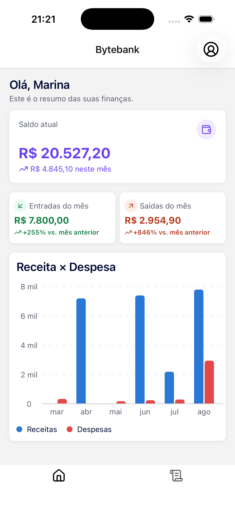
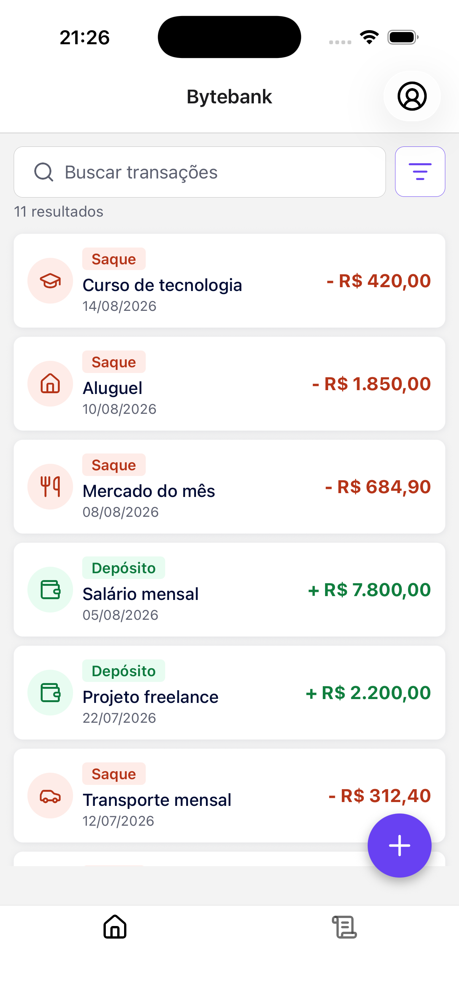

# Bytebank Mobile

Bytebank Mobile é o aplicativo móvel de gerenciamento financeiro da FIAP POSTECH para a Fase 3.

| Dashboard                                      | Transações                                         |
| ---------------------------------------------- | -------------------------------------------------- |
|  |  |

## Sobre o projeto

O Bytebank oferece uma experiência autenticada e individual por usuário para acompanhar e organizar finanças, com dados e arquivos mantidos no Firebase.

## Funcionalidades

- [x] Cadastro com e-mail e senha, login, sessão persistida e logout.
- [x] Dashboard com saldo, resumos de receitas e despesas, gráficos e estados acessíveis de carregamento, vazio e erro.
- [x] Criação, edição, exclusão, listagem e paginação de transações.
- [x] Busca por prefixo na descrição normalizada e filtros por tipo, categoria e intervalo de datas.
- [x] Sugestão de categoria durante o lançamento de transações.
- [x] Anexos de comprovantes JPG, PNG, WEBP e PDF de até 5 MB, armazenados por usuário autenticado.
- [x] Catálogo Storybook no dispositivo para componentes base, formulários, filtros, anexos, KPIs, gráficos e componentes de movimento.

## Tecnologias

- Expo 56
- React Native 0.85 e React 19
- TypeScript 6
- Expo Router
- Firebase 12
- Context API
- NativeWind e Tailwind CSS
- React Hook Form e Zod
- Storybook React Native 10
- Vitest
- EAS Build

## Arquitetura e estrutura

As dependências seguem este fluxo:

```text
app routes -> screens/components -> contexts/hooks -> services -> Firebase
                                      domain (pure rules and schemas)
```

```text
app/                         Expo Router routes and layouts
src/components/ui/           Design-system components and stories
src/components/features/     Feature composition and feedback states
src/screens/                 Auth, dashboard, profile, and transaction screens
src/contexts/                Auth and transaction state providers
src/hooks/                   Dashboard, pagination, attachments, and motion hooks
src/domain/                  Types, schemas, normalization, and pure business rules
src/services/                Firebase, auth, transaction, and storage adapters
.rnstorybook/                On-device Storybook configuration
docs/                        Planning and delivery documentation
```

## Pré-requisitos

- Node.js 20 ou superior; Node.js 24 é recomendado para acompanhar o CI.
- npm e Git; em um clone novo, prefira `npm ci`.
- Um projeto Firebase com permissão para configurar Auth, Firestore, Storage, rules e indexes.
- Expo Go compatível ou um Simulador iOS/Emulador Android com o native development build.
- Xcode para desenvolvimento iOS e Android Studio/JDK para desenvolvimento Android.
- Java 21 somente ao executar a Firebase Emulator Suite exatamente como no CI.
- Uma conta Expo somente para builds em nuvem com EAS.

## Configuração do Firebase

1. Crie um projeto no Firebase.
2. Registre um aplicativo Web, pois o app usa o Firebase JavaScript SDK.
3. Ative `Authentication -> Sign-in method -> Email/Password`.
4. Crie o Cloud Firestore.
5. Ative o Cloud Storage e confirme que o nome do bucket copiado para `.env` termina com o bucket configurado pelo Firebase.
6. Autentique a Firebase CLI, selecione o projeto e publique as rules e os indexes versionados.

```bash
npx -p firebase-tools firebase login
npx -p firebase-tools firebase use --add
npx -p firebase-tools firebase deploy --only firestore:rules,firestore:indexes,storage
```

`firebase use --add` associa o checkout local ao projeto selecionado pelo desenvolvedor; ele não adiciona secrets privados do cliente ao Git.

## Variáveis de ambiente

Crie o arquivo local a partir do exemplo:

```bash
cp .env.example .env
```

Preencha `EXPO_PUBLIC_FIREBASE_API_KEY`, `EXPO_PUBLIC_FIREBASE_AUTH_DOMAIN`, `EXPO_PUBLIC_FIREBASE_PROJECT_ID`, `EXPO_PUBLIC_FIREBASE_STORAGE_BUCKET`, `EXPO_PUBLIC_FIREBASE_MESSAGING_SENDER_ID` e `EXPO_PUBLIC_FIREBASE_APP_ID` com os valores em Firebase Console -> Project settings -> Your apps -> SDK setup and configuration. Mantenha `EXPO_PUBLIC_STORYBOOK=false` para o app normal.

`.env` e `.env.local` são ignorados pelo Git. Valores `EXPO_PUBLIC_*` são incorporados ao bundle do cliente e não devem ser tratados como secrets de servidor. A autorização vem dos caminhos autenticados e das rules versionadas no repositório, não de ocultar a configuração do Firebase.

## Busca e índices do Firestore

As operações de criação e atualização gravam `descriptionNormalized`. As consultas normalizam o termo digitado, aplicam o intervalo `>= prefix` e `<= prefix\uf8ff`, ordenam por descrição normalizada e data, e paginam com cursor de documento. Isso oferece correspondência por prefixo normalizada e sem distinção de maiúsculas/minúsculas ou acentos, não busca arbitrária por substring nem busca full-text. Registros criados antes da existência do campo normalizado precisam de backfill.

| Use                      | Ordered/filter fields                                                |
| ------------------------ | -------------------------------------------------------------------- |
| Type                     | `type ASC`, `date DESC`                                              |
| Category                 | `category ASC`, `date DESC`                                          |
| Type + category          | `type ASC`, `category ASC`, `date DESC`                              |
| Search                   | `descriptionNormalized ASC`, `date DESC`                             |
| Type + search            | `type ASC`, `descriptionNormalized ASC`, `date DESC`                 |
| Category + search        | `category ASC`, `descriptionNormalized ASC`, `date DESC`             |
| Type + category + search | `type ASC`, `category ASC`, `descriptionNormalized ASC`, `date DESC` |

`firebase deploy --only firestore:indexes` publica essas definições. Se uma futura forma de consulta exigir um index ausente, o erro do Firestore ainda pode apresentar um link direto para o Console.

## Segurança

Os dados do Firestore ficam em `users/{uid}/transactions/{transactionId}`; apenas o `uid` autenticado correspondente pode ler ou escrever. Os comprovantes no Storage ficam em `receipts/{uid}/{transactionId}/{fileName}`; apenas o usuário autenticado correspondente pode ler, criar, atualizar ou excluir.

As rules de upload aceitam JPEG, PNG, WEBP ou PDF com no máximo 5 MB.
